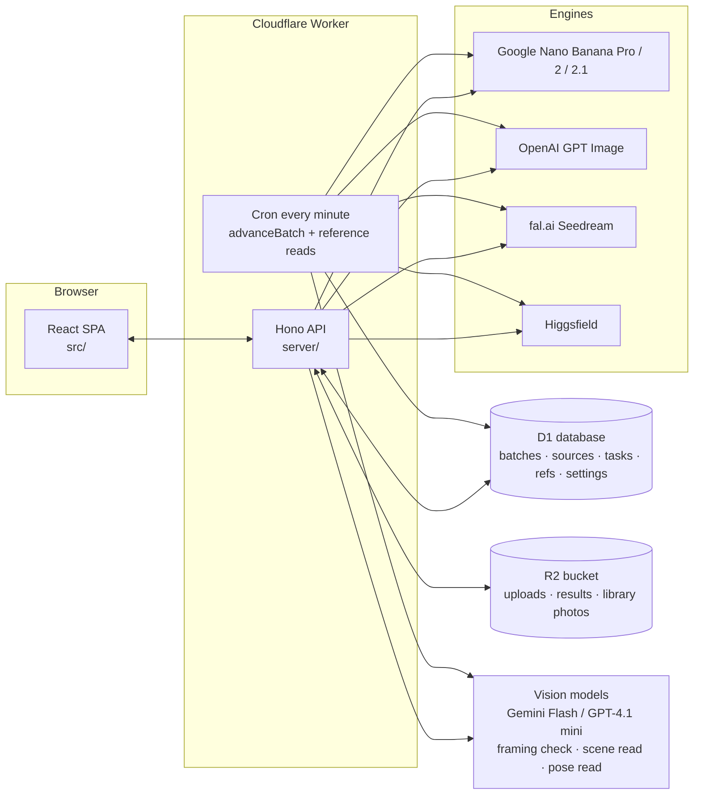
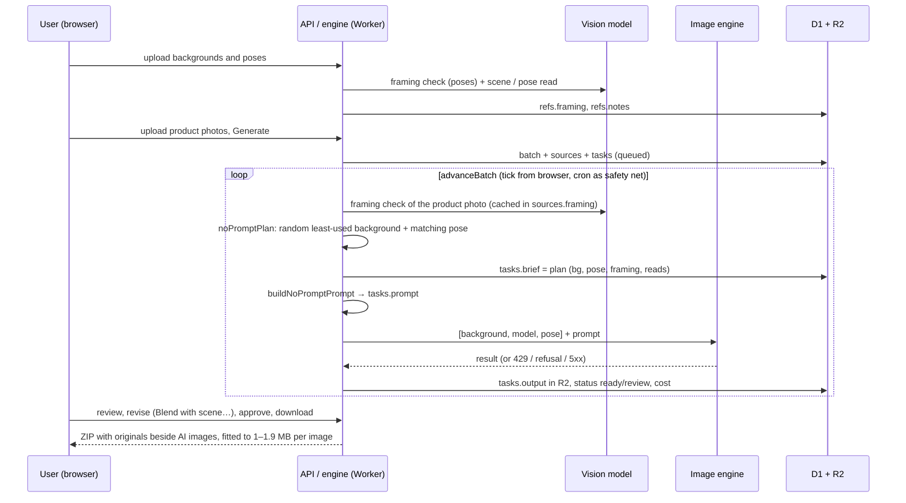

# Max Fashion Studio — system overview

How the studio is built and how an image travels through it, with the No prompt approach as the worked example.

## 1. Architecture



- **Runtime:** one Cloudflare Worker (Workers Paid, 300 s CPU) serves the API and the static SPA. Build: `pnpm check` (lint, typecheck, 91 tests, vite build), deploy with `pnpm run deploy` (wrangler).
- **Storage:** D1 (SQLite) for state, R2 for every image. Settings such as API keys are encrypted at rest.
- **Scheduling:** the browser ticks the active batch while open (also when the tab is hidden); a cron fires every minute as the safety net and runs each active batch inline, plus the warm-up read of library photos without notes.

## 2. Data model (the parts that matter here)

| Table | Row | Key columns |
|---|---|---|
| `batches` | one Generate session | `id`, `owner`, `config` (JSON: mode, engine model, size, output format…), `created` |
| `sources` | one uploaded product photo | `id`, `batch`, `name` (`ProductID_01.jpg`), `key` (R2), `framing` (cached framing check), `skill` (per-photo skill, approach 7) |
| `tasks` | one image to make (card) | `id`, `batch`, `source`, `card`, `status` (queued → processing → finalizing → ready/review → approved), `prompt` (exact text sent), `brief` (skill brief or No prompt plan), `output` (R2 key), `qa`, `cost`, `model` (per-task engine override), `error`, `attempts`, `request_id` |
| `refs` | one library photo | `id`, `skill` (`np-bg`, `np-pose`, or a skill's mood board), `key` (R2), `name`, `framing` (poses), `notes` (vision read), `created` |
| `settings` | key/value | engine keys, model cache, cached engine upload URLs per reference |

## 3. The nine approaches

| id | Name | Prompt source |
|---|---|---|
| 1 | Lifestyle set | deterministic builder, 5 cards + fabric card |
| 2–4, 6 | Studio / catalogue variants | deterministic builder |
| 5 | Skill campaign — same model | written brief (vision prompt builder) |
| 7 | Creative direction | written brief, 800–1,000 words, mood board, skill picker, saved looks |
| 8 | Skill campaign — new model | written brief, model replaced |
| **9** | **No prompt** | **fixed rules + library photos, no builder** |

Approaches 5, 7 and 8 are set-aware (the highest shot of a product leads, the others follow its brief). Approach 9 is not: every image is independent and runs in parallel.

## 4. Pipeline for one No prompt image



Steps in words:

1. **Upload** of library photos: stored in R2, a pose gets its framing, both kinds get their read. The cron re-reads anything that failed.
2. **Upload** of product photos: names are parsed into product id and shot number; the batch and its tasks are created.
3. **advanceBatch** runs on every tick: finalize in-flight results, then submit the next queued tasks up to the engine's parallelism.
4. **Plan:** the product photo's framing is verified; a background and a pose are picked at random without repeats; the cached reads are attached; the plan is stored on the task.
5. **Prompt:** the fixed rules are assembled with the reads and the framing lock; the text is stored on the task so the review dialog can show it.
6. **Engine call** with the location photo first, the model photo second, the pose third.
7. **Finalize:** the result lands in R2; the QA fields and the cost are stored; failures route to retry, provider switch (rate limit), per-image engine fallback (content refusal) or pause (daily quota).
8. **Review and export:** compare slider, revision presets, approve, download per set or as a ZIP with the originals, each export fitted to 1 to 1.9 MB.

## 5. Resilience built into the pipeline

- Builder and engine rate limits switch provider; a daily quota pauses the batch with a message.
- Content-checker refusals fall back per image through `gemini-3-pro-image` → `nano-banana-pro` → `gpt-image-1`, with a child-safe compact prompt where relevant.
- Lost submissions refund their estimate; no automatic recentre or regeneration.
- The SPA has an error boundary with automatic reload on a stale chunk and a toast when a new build is live (`X-Build` header).
- Hidden tabs keep ticking; the cron covers a closed browser.

## 6. Repository layout

```
max-fashion-studio/
├── server/        Hono API, engine, editorial (vision), engines (google, openai, fal, higgsfield), auth, admin
├── shared/        config, prompts, pricing, naming, safety, skills, zaid, errors (used by both sides)
├── src/           React SPA: studio screens, review dialog, libraries, zip export
├── migrations/    D1 migrations 0001 … 0015
├── tests/         vitest suites (prompts, editorial, naming, pricing, errors, signed …)
├── public/        mode cards and static assets
└── wrangler.jsonc Worker config (D1, R2, cron, CPU limit)
```
